# PICQA Analysis Report

_Generated 2026-04-29 07:23:35 by picqa._

## Inventory

- Source directory: `/home/claude/HY202103_data`
- Total XML files: **709** (484.8 MB)
- Files per wafer: D07=28, D08=196, D23=238, D24=247

### Test site distribution

| Test site | Count |
|---|---|
| ALIGN_WAFER_CTE | 131 |
| DCM_FGCOTE_1DC | 74 |
| DCM_GPDO | 70 |
| DCM_LMZO | 70 |
| PCM_PSLOTE_P1N1 | 70 |
| DCM_M12OTE | 42 |
| DCM_M22OTE | 42 |
| OTEST_L3OTE | 42 |
| OTEST_L4OTE | 42 |
| PCM_DC3OTE_WG | 42 |
| PCM_L_EXPO | 42 |
| DCM_LMZC | 28 |
| PCM_PSLCTE_P1N1 | 14 |

## MZM feature extraction

Extracted 98 MZM measurements from `DCM_LMZO` (O-band) and `DCM_LMZC` (C-band). Failed-contact flag added via leakage + tuning-slope thresholds.
Flagged as failed-contact: **38 / 98**

**Wafer × band breakdown:**

| Wafer   | Band   |   n |
|:--------|:-------|----:|
| D07     | C      |  14 |
| D08     | C      |  14 |
| D08     | O      |  14 |
| D23     | O      |  28 |
| D24     | O      |  28 |

Sample of features (first 20 rows):

| Wafer   |         Session | Die     | Device               | TestSite   |   DieCol |   DieRow | Band   |   DesignWavelength_nm |   FSR_nm |   Notch_at_0V_nm |   dLambda_dV_pm_per_V |   PeakIL_dB |   PeakIL_near_1310_dB |   I_at_-1V_pA |   I_at_-2V_pA | FailedContact   |
|:--------|----------------:|:--------|:---------------------|:-----------|---------:|---------:|:-------|----------------------:|---------:|-----------------:|----------------------:|------------:|----------------------:|--------------:|--------------:|:----------------|
| D07     | 20190715_190855 | (-1,-1) | MZMCTE_LULAB_450_500 | DCM_LMZC   |       -1 |       -1 | C      |                  1550 |   14.45  |             1551 |                -191.4 |     -11.2   |               -11.2   |     2.603e+04 |     3.286e+04 | False           |
| D07     | 20190715_190855 | (-3,-1) | MZMCTE_LULAB_450_500 | DCM_LMZC   |       -3 |       -1 | C      |                  1550 |   14.35  |             1545 |                -240.9 |     -10.1   |               -10.1   |     4.891e+04 |     7.319e+04 | False           |
| D07     | 20190715_190855 | (3,-1)  | MZMCTE_LULAB_450_500 | DCM_LMZC   |        3 |       -1 | C      |                  1550 |   14.24  |             1544 |                -256.3 |     -10.84  |               -10.84  |     4.592e+04 |     6.794e+04 | False           |
| D07     | 20190715_190855 | (-3,-3) | MZMCTE_LULAB_450_500 | DCM_LMZC   |       -3 |       -3 | C      |                  1550 |   14.19  |             1549 |                -243.8 |     -10.75  |               -10.75  |     5.465e+04 |     8.568e+04 | False           |
| D07     | 20190715_190855 | (0,-3)  | MZMCTE_LULAB_450_500 | DCM_LMZC   |        0 |       -3 | C      |                  1550 |   14.18  |             1545 |                -254.5 |     -10.05  |               -10.05  |     4.815e+04 |     7.129e+04 | False           |
| D07     | 20190715_190855 | (2,-3)  | MZMCTE_LULAB_450_500 | DCM_LMZC   |        2 |       -3 | C      |                  1550 |   14.38  |             1550 |                -255.1 |     -13.81  |               -13.81  |     6.663e+04 |     1.077e+05 | False           |
| D07     | 20190715_190855 | (-1,-4) | MZMCTE_LULAB_450_500 | DCM_LMZC   |       -1 |       -4 | C      |                  1550 |   14.22  |             1549 |                -251.2 |     -11.84  |               -11.84  |     7.783e+04 |     1.28e+05  | False           |
| D07     | 20190715_190855 | (-4,0)  | MZMCTE_LULAB_450_500 | DCM_LMZC   |       -4 |        0 | C      |                  1550 |   14.2   |             1553 |                -234.4 |     -11.64  |               -11.64  |     6.76e+04  |     1.1e+05   | False           |
| D07     | 20190715_190855 | (0,0)   | MZMCTE_LULAB_450_500 | DCM_LMZC   |        0 |        0 | C      |                  1550 |   14.56  |             1550 |                -233.1 |     -11.97  |               -11.97  |  8955         |     1.067e+04 | False           |
| D07     | 20190715_190855 | (2,0)   | MZMCTE_LULAB_450_500 | DCM_LMZC   |        2 |        0 | C      |                  1550 |   14.4   |             1549 |                -223.4 |     -10.09  |               -10.09  |     4.151e+04 |     5.963e+04 | False           |
| D07     | 20190715_190855 | (-1,2)  | MZMCTE_LULAB_450_500 | DCM_LMZC   |       -1 |        2 | C      |                  1550 |   14.46  |             1549 |                -230.4 |     -10.41  |               -10.41  |     4.595e+04 |     6.834e+04 | False           |
| D07     | 20190715_190855 | (-3,2)  | MZMCTE_LULAB_450_500 | DCM_LMZC   |       -3 |        2 | C      |                  1550 |   14.37  |             1544 |                -255.8 |     -10.98  |               -10.98  |     6.185e+04 |     1.001e+05 | False           |
| D07     | 20190715_190855 | (2,2)   | MZMCTE_LULAB_450_500 | DCM_LMZC   |        2 |        2 | C      |                  1550 |   14.31  |             1552 |                -244.7 |     -10.89  |               -10.89  |     4.805e+04 |     7.171e+04 | False           |
| D07     | 20190715_190855 | (0,3)   | MZMCTE_LULAB_450_500 | DCM_LMZC   |        0 |        3 | C      |                  1550 |   14.4   |             1547 |                -256.8 |     -10.28  |               -10.28  |     4.972e+04 |     7.649e+04 | False           |
| D08     | 20190526_082853 | (-1,-1) | MZMOTE_LULAB_380_500 | DCM_LMZO   |       -1 |       -1 | O      |                  1310 |    9.821 |             1313 |                -158.8 |      -6.672 |                -6.672 |     5.313e+04 |     9.726e+04 | False           |
| D08     | 20190526_082853 | (-3,-1) | MZMOTE_LULAB_380_500 | DCM_LMZO   |       -3 |       -1 | O      |                  1310 |    9.857 |             1308 |                -163.7 |      -9.244 |                -9.244 |     6.287e+04 |     1.15e+05  | False           |
| D08     | 20190526_082853 | (3,-1)  | MZMOTE_LULAB_380_500 | DCM_LMZO   |        3 |       -1 | O      |                  1310 |    9.902 |             1308 |                -217.2 |      -9.008 |                -9.008 |     5.357e+04 |     9.686e+04 | False           |
| D08     | 20190526_082853 | (-3,-3) | MZMOTE_LULAB_380_500 | DCM_LMZO   |       -3 |       -3 | O      |                  1310 |    9.837 |             1308 |                -182.1 |      -9.941 |                -9.941 |     6.762e+04 |     1.252e+05 | False           |
| D08     | 20190526_082853 | (0,-3)  | MZMOTE_LULAB_380_500 | DCM_LMZO   |        0 |       -3 | O      |                  1310 |    9.82  |             1306 |                -167.6 |      -8.225 |                -8.225 |     3.848e+04 |     7.148e+04 | False           |
| D08     | 20190526_082853 | (2,-3)  | MZMOTE_LULAB_380_500 | DCM_LMZO   |        2 |       -3 | O      |                  1310 |    9.889 |             1314 |                -185.7 |      -8.631 |                -8.631 |     5.938e+04 |     1.092e+05 | False           |

## Robust statistics per (wafer, session)

| Wafer   |         Session | metric              |       median |      mad_std |   n |
|:--------|----------------:|:--------------------|-------------:|-------------:|----:|
| D07     | 20190715_190855 | FSR_nm              |   14.36      |    0.1389    |  14 |
| D07     | 20190715_190855 | Notch_at_0V_nm      | 1549         |    2.941     |  14 |
| D07     | 20190715_190855 | dLambda_dV_pm_per_V | -244.2       |   16.3       |  14 |
| D07     | 20190715_190855 | PeakIL_dB           |  -10.87      |    1.005     |  14 |
| D07     | 20190715_190855 | I_at_-1V_pA         |    4.853e+04 | 9748         |  14 |
| D08     | 20190526_082853 | FSR_nm              |    9.829     |    0.05434   |  14 |
| D08     | 20190526_082853 | Notch_at_0V_nm      | 1311         |    2.887     |  14 |
| D08     | 20190526_082853 | dLambda_dV_pm_per_V | -182.8       |   18.55      |  14 |
| D08     | 20190526_082853 | PeakIL_dB           |   -7.984     |    1.484     |  14 |
| D08     | 20190526_082853 | I_at_-1V_pA         |    5.647e+04 |    1.98e+04  |  14 |
| D08     | 20190712_113254 | FSR_nm              |   14.24      |    0.1124    |  14 |
| D08     | 20190712_113254 | Notch_at_0V_nm      | 1548         |    2.937     |  14 |
| D08     | 20190712_113254 | dLambda_dV_pm_per_V | -239.8       |   16.45      |  14 |
| D08     | 20190712_113254 | PeakIL_dB           |  -10.55      |    0.7005    |  14 |
| D08     | 20190712_113254 | I_at_-1V_pA         |  444.5       |  598.8       |  14 |
| D23     | 20190531_072042 | FSR_nm              |    9.863     |    0.1156    |  14 |
| D23     | 20190531_072042 | Notch_at_0V_nm      | 1311         |    3.873     |  14 |
| D23     | 20190531_072042 | dLambda_dV_pm_per_V |   -0.6114    |    2.711     |  14 |
| D23     | 20190531_072042 | PeakIL_dB           |   -7.644     |    1.026     |  14 |
| D23     | 20190531_072042 | I_at_-1V_pA         | -120.2       |    0.9317    |  14 |
| D23     | 20190603_204847 | FSR_nm              |    9.843     |    0.1302    |  14 |
| D23     | 20190603_204847 | Notch_at_0V_nm      | 1311         |    3.884     |  14 |
| D23     | 20190603_204847 | dLambda_dV_pm_per_V | -135.3       |   12.5       |  14 |
| D23     | 20190603_204847 | PeakIL_dB           |   -7.656     |    0.9811    |  14 |
| D23     | 20190603_204847 | I_at_-1V_pA         |    1.747e+05 |    4.159e+04 |  14 |
| D24     | 20190531_151815 | FSR_nm              |    9.848     |    0.07865   |  14 |
| D24     | 20190531_151815 | Notch_at_0V_nm      | 1310         |    3.716     |  14 |
| D24     | 20190531_151815 | dLambda_dV_pm_per_V |   -1.106     |    2.927     |  14 |
| D24     | 20190531_151815 | PeakIL_dB           |   -8.28      |    1.09      |  14 |
| D24     | 20190531_151815 | I_at_-1V_pA         | -120.4       |    2.019     |  14 |
| D24     | 20190603_225101 | FSR_nm              |    9.824     |    0.06783   |  14 |
| D24     | 20190603_225101 | Notch_at_0V_nm      | 1309         |    3.677     |  14 |
| D24     | 20190603_225101 | dLambda_dV_pm_per_V | -124.8       |   13.25      |  14 |
| D24     | 20190603_225101 | PeakIL_dB           |   -8.145     |    1.473     |  14 |
| D24     | 20190603_225101 | I_at_-1V_pA         |    2.591e+05 |    3.574e+04 |  14 |

## Yield evaluation

Spec: `mzm` with rules: `{'I_at_-1V_pA': {'max_abs': 1000000.0}, 'dLambda_dV_pm_per_V': {'min_abs': 100}, 'PeakIL_near_1310_dB': {'min': -12}, 'FSR_nm': {'min': 9.3, 'max': 10.3}}`

### Per-wafer yield

| Wafer   |   n_total |   n_pass |   yield_pct |
|:--------|----------:|---------:|------------:|
| D07     |        14 |        0 |           0 |
| D08     |        28 |       14 |          50 |
| D23     |        28 |       14 |          50 |
| D24     |        28 |       14 |          50 |

### Per-session yield

| Wafer   |         Session |   n_total |   n_pass |   yield_pct |
|:--------|----------------:|----------:|---------:|------------:|
| D07     | 20190715_190855 |        14 |        0 |           0 |
| D08     | 20190526_082853 |        14 |       14 |         100 |
| D08     | 20190712_113254 |        14 |        0 |           0 |
| D23     | 20190531_072042 |        14 |        0 |           0 |
| D23     | 20190603_204847 |        14 |       14 |         100 |
| D24     | 20190531_151815 |        14 |        0 |           0 |
| D24     | 20190603_225101 |        14 |       14 |         100 |

## Project 1 — Wafer-level process uniformity

### Grating coupler IL: center vs edge dies

Edge_radius threshold = 2.5 die-units (R ≤ 2.5 → center).

| Wafer   | metric              |   n_center |   n_edge |   center_median |   edge_median |   center_CV_pct |   edge_CV_pct |   delta_center_minus_edge |
|:--------|:--------------------|-----------:|---------:|----------------:|--------------:|----------------:|--------------:|--------------------------:|
| D07     | PeakIL_near_1310_dB |          4 |       10 |         -10.8   |       -10.87  |           7.732 |         10.04 |                    0.0653 |
| D08     | PeakIL_near_1310_dB |          8 |       20 |          -8.379 |        -9.895 |          23.49  |         20.24 |                    1.516  |
| D23     | PeakIL_near_1310_dB |          8 |       20 |          -7.112 |        -8.15  |           1.964 |         14.3  |                    1.037  |
| D24     | PeakIL_near_1310_dB |          8 |       20 |          -6.902 |        -8.539 |           2.843 |         10.26 |                    1.637  |

### FSR variation → implied geometry / index variation

`FSR_relative_variation_pct = σ(FSR) / mean(FSR) × 100`. For an unbalanced MZI, this approximates Δn_g/n_g, which in turn reflects waveguide width / thickness uniformity across the wafer.

| Wafer   |         Session |   n |   FSR_mean_nm |   FSR_std_nm |   FSR_relative_variation_pct |   Implied_index_variation_pct |
|:--------|----------------:|----:|--------------:|-------------:|-----------------------------:|------------------------------:|
| D07     | 20190715_190855 |  14 |        14.34  |      0.1181  |                       0.8238 |                        0.8238 |
| D08     | 20190526_082853 |  14 |         9.821 |      0.05801 |                       0.5906 |                        0.5906 |
| D08     | 20190712_113254 |  14 |        14.25  |      0.08609 |                       0.6043 |                        0.6043 |
| D23     | 20190531_072042 |  14 |         9.855 |      0.08348 |                       0.8471 |                        0.8471 |
| D23     | 20190603_204847 |  14 |         9.84  |      0.08798 |                       0.8941 |                        0.8941 |
| D24     | 20190531_151815 |  14 |         9.852 |      0.06099 |                       0.6191 |                        0.6191 |
| D24     | 20190603_225101 |  14 |         9.82  |      0.06691 |                       0.6814 |                        0.6814 |

### IV uniformity (leakage at -1 V)

Per-session statistics including robust median + MAD-based σ alongside parametric mean / std / CV. Sessions with failed contact show extremely low absolute means (~100 pA) compared to working ones (10⁴–10⁵ pA).

| Wafer   |         Session |   n |         mean |         std |   CV_pct |          min |          max |       median |      mad_std |
|:--------|----------------:|----:|-------------:|------------:|---------:|-------------:|-------------:|-------------:|-------------:|
| D07     | 20190715_190855 |  14 |    4.941e+04 |   1.73e+04  |   35.01  | 8955         |    7.783e+04 |    4.853e+04 | 9748         |
| D08     | 20190526_082853 |  14 |    5.611e+04 |   1.476e+04 |   26.3   |    3.444e+04 |    7.64e+04  |    5.647e+04 |    1.98e+04  |
| D08     | 20190712_113254 |  14 |  836.3       | 931.9       |  111.4   |   -5.754     | 2718         |  444.5       |  598.8       |
| D23     | 20190531_072042 |  14 | -119.5       |   1.561     |    1.307 | -121.2       | -116.7       | -120.2       |    0.9317    |
| D23     | 20190603_204847 |  14 |    1.765e+05 |   3.429e+04 |   19.43  |    1.302e+05 |    2.389e+05 |    1.747e+05 |    4.159e+04 |
| D24     | 20190531_151815 |  14 | -120         |   2.53      |    2.108 | -122.8       | -113.1       | -120.4       |    2.019     |
| D24     | 20190603_225101 |  14 |    2.639e+05 |   2.798e+04 |   10.6   |    2.259e+05 |    3.056e+05 |    2.591e+05 |    3.574e+04 |

## Project 2 — Voltage-based phase modulator characterisation

Extracted Vπ, Vπ·L, and extinction ratio for 98/98 dies. Vπ = FSR / (2·|dλ/dV|). Phase-shifter length is parsed best-effort from the device name; if absent, Vπ·L is left as NaN.

### Per-wafer Vπ summary (working dies)

| Wafer   |   Vpi_V_count |   Vpi_V_median |   Vpi_V_std |   Vpi_L_V_cm_count |   Vpi_L_V_cm_median |   Vpi_L_V_cm_std |   ER_at_-2V_dB_count |   ER_at_-2V_dB_median |   ER_at_-2V_dB_std |
|:--------|--------------:|---------------:|------------:|-------------------:|--------------------:|-----------------:|---------------------:|----------------------:|-------------------:|
| D07     |            14 |          29.17 |       2.68  |                 14 |               1.313 |            0.121 |                   14 |                 35.12 |              5.424 |
| D08     |            18 |          27.51 |       2.25  |                 18 |               1.063 |            0.145 |                   18 |                 31.61 |              5.82  |
| D23     |            14 |          36.44 |       3.262 |                 14 |               1.385 |            0.124 |                   14 |                 31.62 |              3.333 |
| D24     |            14 |          39.22 |       3.825 |                 14 |               1.49  |            0.145 |                   14 |                 29.93 |              3.181 |

## PN modulator (PCM_PSLOTE_P1N1) analysis

Extracted 252 segment rows over 84 dies. Each die has three PN segments (typically 500 / 1500 / 2500 µm) plus a reference waveguide; per-µm doping loss and electroabsorption modulation efficiency are obtained by linear fits versus segment length.

### Per-die length-fit results (first 20 rows)

| Wafer   |         Session | Die     | Device          | TestSite        |   DieCol |   DieRow | Band   |   n_lengths |   Loss_per_um_dB_per_um |   Loss_intercept_dB |   Loss_R2 |   Modulation_per_um_dB_per_V_per_um |   Modulation_intercept_dB_per_V |   Modulation_R2 |
|:--------|----------------:|:--------|:----------------|:----------------|---------:|---------:|:-------|------------:|------------------------:|--------------------:|----------:|------------------------------------:|--------------------------------:|----------------:|
| D07     | 20190715_190855 | (-1,-1) | PCM_PSLCTE_P1N1 | PCM_PSLCTE_P1N1 |       -1 |       -1 | C      |           3 |               -0.001788 |             0.2869  |    0.9994 |                          -0.0001052 |                        0.00946  |          0.9969 |
| D07     | 20190715_190855 | (-1,-4) | PCM_PSLCTE_P1N1 | PCM_PSLCTE_P1N1 |       -1 |       -4 | C      |           3 |               -0.002054 |             0.2433  |    0.9983 |                          -0.0001074 |                        0.005255 |          0.988  |
| D07     | 20190715_190855 | (-1,2)  | PCM_PSLCTE_P1N1 | PCM_PSLCTE_P1N1 |       -1 |        2 | C      |           3 |               -0.001528 |            -0.07415 |    0.9991 |                          -9.963e-05 |                       -0.0186   |          0.9996 |
| D07     | 20190715_190855 | (-3,-1) | PCM_PSLCTE_P1N1 | PCM_PSLCTE_P1N1 |       -3 |       -1 | C      |           3 |               -0.001592 |             0.3068  |    0.9994 |                          -0.0001087 |                        0.006755 |          0.996  |
| D07     | 20190715_190855 | (-3,-3) | PCM_PSLCTE_P1N1 | PCM_PSLCTE_P1N1 |       -3 |       -3 | C      |           3 |               -0.002112 |             0.3524  |    0.9997 |                          -0.0001261 |                        0.01912  |          0.9968 |
| D07     | 20190715_190855 | (-3,2)  | PCM_PSLCTE_P1N1 | PCM_PSLCTE_P1N1 |       -3 |        2 | C      |           3 |               -0.001722 |            -0.02955 |    0.9979 |                          -9.002e-05 |                       -0.03135  |          0.9992 |
| D07     | 20190715_190855 | (-4,0)  | PCM_PSLCTE_P1N1 | PCM_PSLCTE_P1N1 |       -4 |        0 | C      |           3 |               -0.001926 |             0.2528  |    0.9999 |                          -0.0001289 |                        0.03483  |          0.994  |
| D07     | 20190715_190855 | (0,-3)  | PCM_PSLCTE_P1N1 | PCM_PSLCTE_P1N1 |        0 |       -3 | C      |           3 |               -0.001681 |             0.2212  |    0.9999 |                          -9.776e-05 |                       -0.01686  |          0.9995 |
| D07     | 20190715_190855 | (0,0)   | PCM_PSLCTE_P1N1 | PCM_PSLCTE_P1N1 |        0 |        0 | C      |           3 |               -0.001898 |             0.3316  |    0.9987 |                          -0.0001141 |                        0.0126   |          1      |
| D07     | 20190715_190855 | (0,3)   | PCM_PSLCTE_P1N1 | PCM_PSLCTE_P1N1 |        0 |        3 | C      |           3 |               -0.001749 |             0.191   |    0.9945 |                          -0.0001094 |                       -0.003824 |          0.9991 |
| D07     | 20190715_190855 | (2,-3)  | PCM_PSLCTE_P1N1 | PCM_PSLCTE_P1N1 |        2 |       -3 | C      |           3 |               -0.001973 |             0.1785  |    0.9999 |                          -0.0001044 |                       -0.02393  |          0.9518 |
| D07     | 20190715_190855 | (2,0)   | PCM_PSLCTE_P1N1 | PCM_PSLCTE_P1N1 |        2 |        0 | C      |           3 |               -0.001795 |             1.632   |    0.998  |                          -0.0001019 |                       -0.03616  |          0.9998 |
| D07     | 20190715_190855 | (2,2)   | PCM_PSLCTE_P1N1 | PCM_PSLCTE_P1N1 |        2 |        2 | C      |           3 |               -0.001896 |             0.2757  |    0.9992 |                          -0.0001284 |                        0.01475  |          0.9647 |
| D07     | 20190715_190855 | (3,-1)  | PCM_PSLCTE_P1N1 | PCM_PSLCTE_P1N1 |        3 |       -1 | C      |           3 |               -0.001977 |            13.18    |    0.9987 |                          -0.0001392 |                        0.04165  |          1      |
| D08     | 20190526_082853 | (-1,-1) | PCM_PSLOTE_P1N1 | PCM_PSLOTE_P1N1 |       -1 |       -1 | O      |           3 |               -0.001074 |             0.1454  |    0.9971 |                          -6.006e-05 |                       -0.0126   |          0.9503 |
| D08     | 20190526_082853 | (-1,-4) | PCM_PSLOTE_P1N1 | PCM_PSLOTE_P1N1 |       -1 |       -4 | O      |           3 |               -0.001118 |             0.03884 |    0.9995 |                          -4.977e-05 |                       -0.02997  |          0.8708 |
| D08     | 20190526_082853 | (-1,2)  | PCM_PSLOTE_P1N1 | PCM_PSLOTE_P1N1 |       -1 |        2 | O      |           3 |               -0.00107  |             0.2443  |    1      |                          -8.423e-05 |                        0.02375  |          0.9794 |
| D08     | 20190526_082853 | (-3,-1) | PCM_PSLOTE_P1N1 | PCM_PSLOTE_P1N1 |       -3 |       -1 | O      |           3 |               -0.001137 |             0.201   |    0.9985 |                          -7.671e-05 |                        0.007362 |          0.9952 |
| D08     | 20190526_082853 | (-3,-3) | PCM_PSLOTE_P1N1 | PCM_PSLOTE_P1N1 |       -3 |       -3 | O      |           3 |               -0.001004 |            -0.1021  |    0.9996 |                          -5.323e-05 |                       -0.01545  |          0.8416 |
| D08     | 20190526_082853 | (-3,2)  | PCM_PSLOTE_P1N1 | PCM_PSLOTE_P1N1 |       -3 |        2 | O      |           3 |               -0.001193 |             0.3137  |    0.9997 |                          -9.394e-05 |                        0.02439  |          0.9971 |

## Figures

### IV characteristics (MZM)
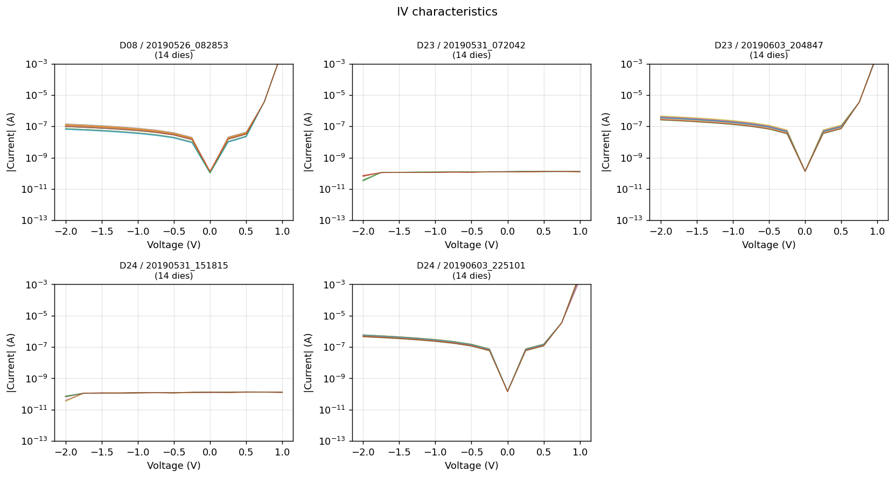

### Transmission spectra @ -2V (MZM)
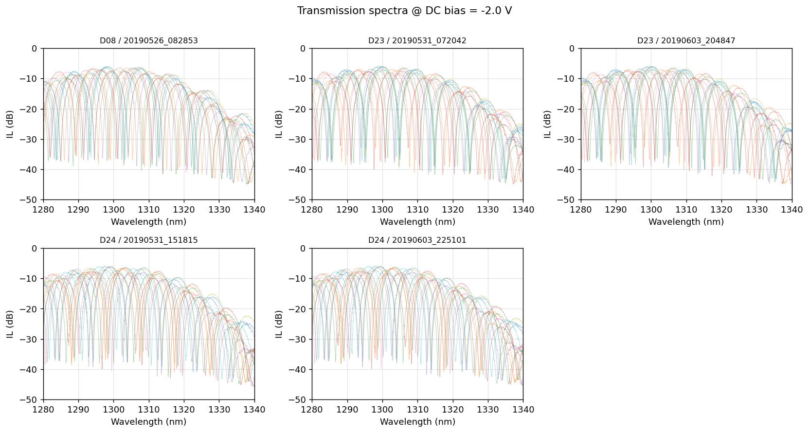

### Bias-dependent spectrum (representative MZM die)
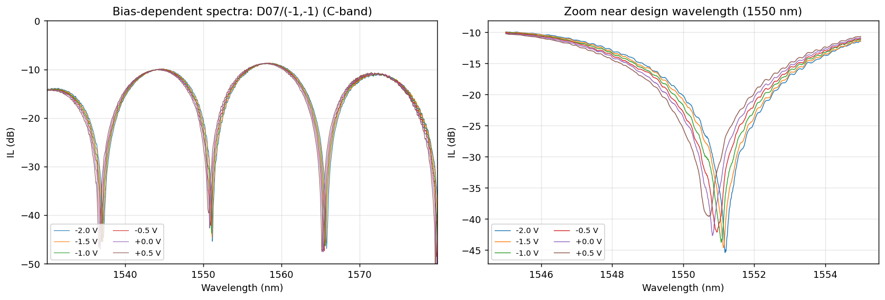

### MZM wafer maps
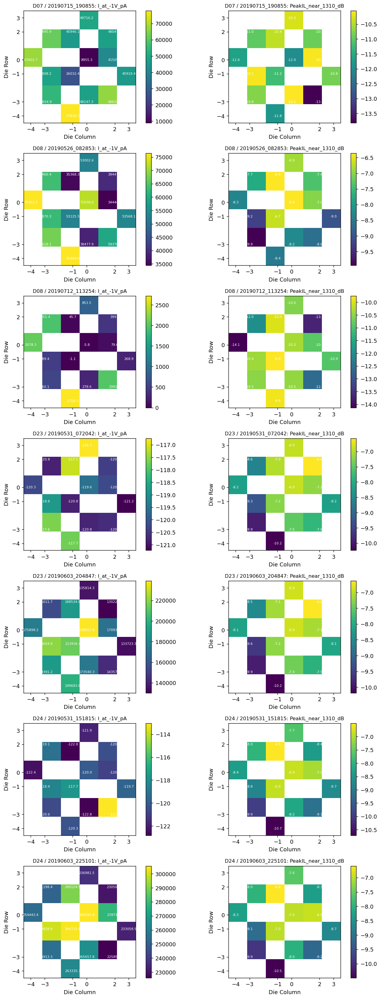

### MZM summary panels
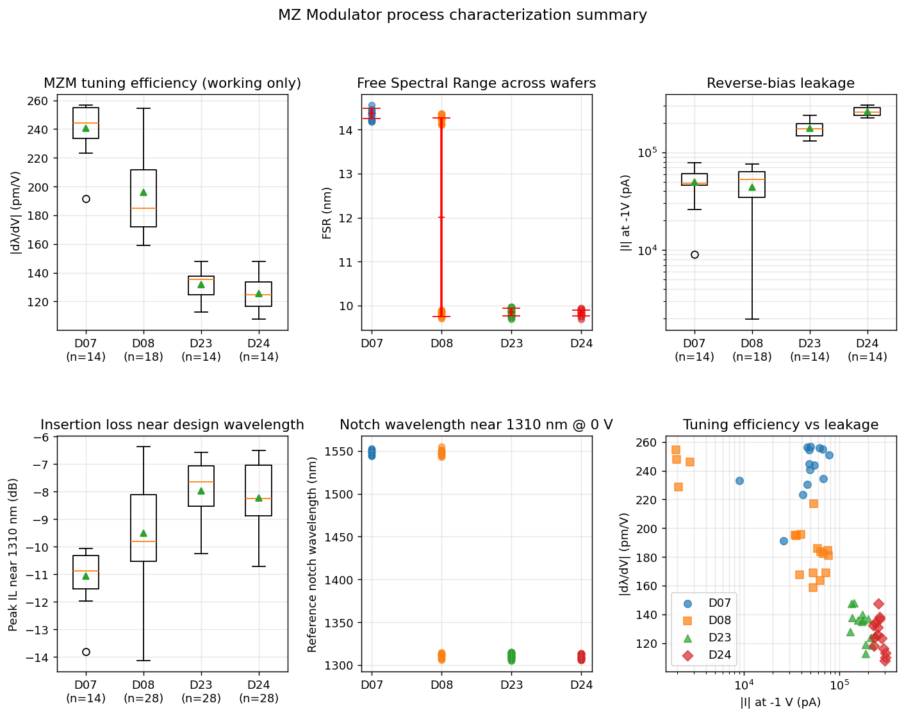

### PN modulator length dependence
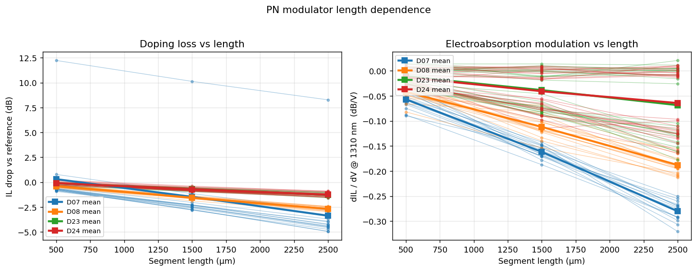

### PN modulator summary panels
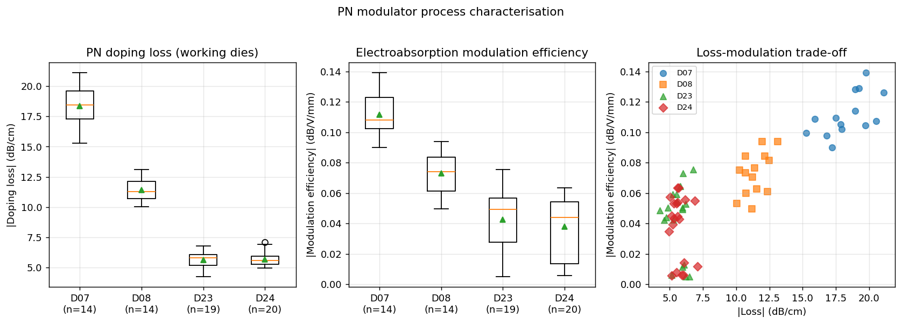

### (Project 1) Grating coupler IL vs wafer radius
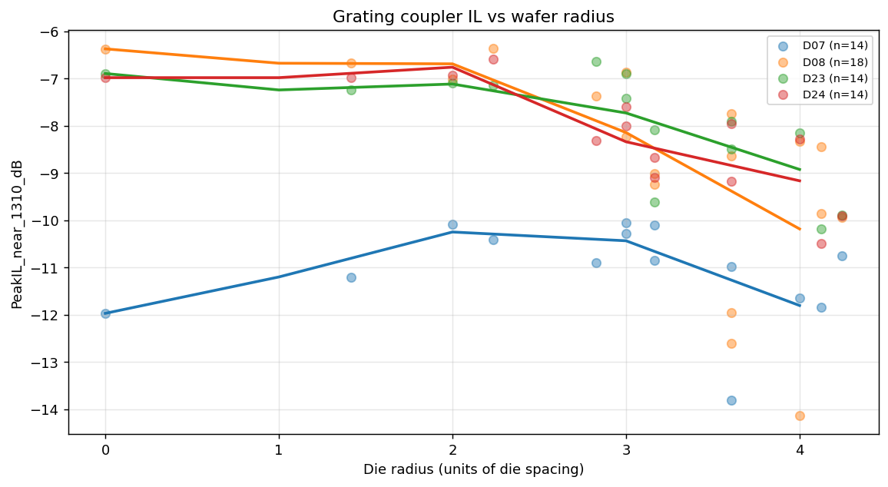

### (Project 1) Center vs edge boxplots
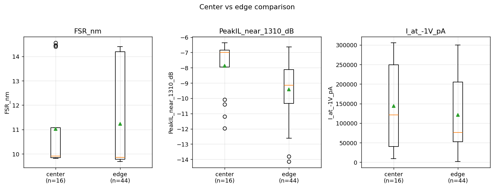

### (Project 2) Representative V-φ curve
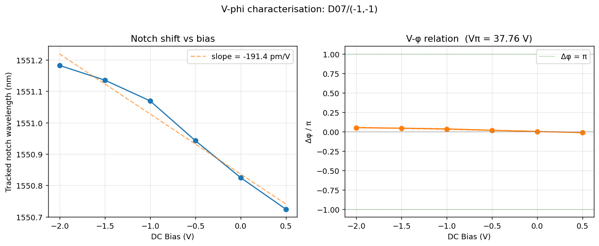

### (Project 2) Detailed V-π·L analysis (six panels)
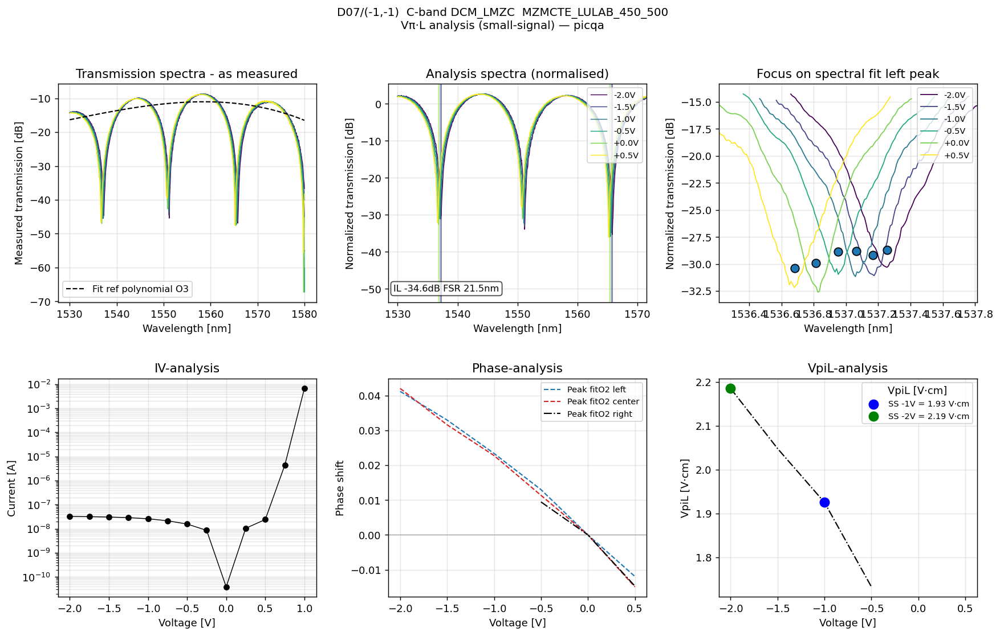

### (Project 2) Vπ distribution and Vπ·L figure of merit
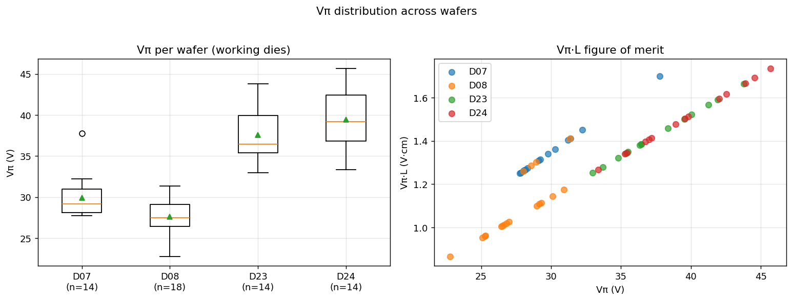
